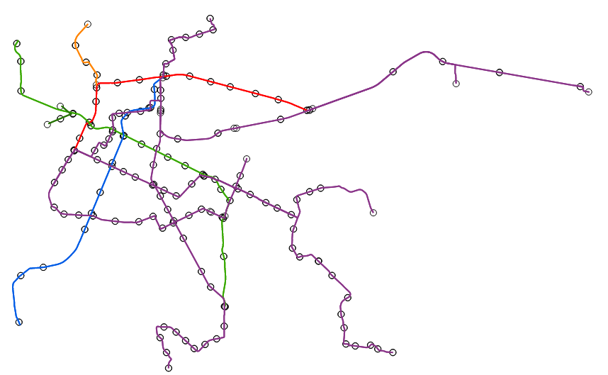

### LEFEBVRE Julien & MERCIER Loris & RAVELLA Nino
# Projet_Data_Viz

## Liens utiles
### Info générales
- [Horaire temps réelle](https://data.grandlyon.com/portail/fr/jeux-de-donnees/prochains-passages-reseau-transports-commun-lyonnais-rhonexpress-disponibilites-temps-reel/info)
- [Horaire temps théoriques](https://data.grandlyon.com/portail/fr/jeux-de-donnees/horaires-theoriques-reseau-transports-commun-lyonnais/telechargements) (*Trop lourd pour github : Choisir codage NEPTUNE lors du téléchargement*)
- [Info traffic temps réelle](https://data.grandlyon.com/portail/fr/jeux-de-donnees/alertes-trafic-reseau-transports-commun-lyonnais-v2/api)
- [Accessibilité](https://data.grandlyon.com/portail/fr/jeux-de-donnees/alerte-accessibilite-reseau-transports-commun-lyonnais/api)

### Info géographiques
- [Ligne Métro/Funi](https://data.grandlyon.com/portail/fr/jeux-de-donnees/lignes-metro-funiculaire-reseau-transports-commun-lyonnais-v2/info) --> (*[voir fichier](./data/sytral_tcl_sytral.tcllignemetrofuni_2_0_0.json)*)
- [Ligne Tram](https://data.grandlyon.com/portail/fr/jeux-de-donnees/lignes-tramway-reseau-transports-commun-lyonnais-v2/info) --> (*[voir fichier](./data/sytral_tcl_sytral.tcllignetram_2_0_0.json)*)
- [Point d'arrêt](https://data.grandlyon.com/portail/fr/jeux-de-donnees/points-arret-reseau-transports-commun-lyonnais/telechargements) --> (*[voir fichier](./data/sytral_tcl_sytral.tclarret.json)*)

## Avancement
### Séance 1 : 13 décembre
**Tous les 3 :** 
- Brainstorming sur les données à utiliser et les visualisations à faire. => *Choix pour une visualisation du réseau TCL avec horaire et affluence.*
- Recherche des données sur le site de la métropole de Lyon. 
- Test des API temps réelles

### Séance 2 : 19 décembre
**Loris & Julien :**
- Débrief et analyse des données trouvées.
- Filtrage des données pour ne garder que les arrêts de métro et tram.
  - Création du fichier [sytral_tcl_sytral.tclarret_sans_bus.json](./data/sytral_tcl_sytral.tclarret_sans_bus.json) qui contient les arrêts de métro, tram et funiculaire.
- Première visualisation brute:
  -  Configuration de la projections
  - Affichage des arrêts de métro, tram et funiculaire
  - Affichage des lignes de métro, tram et funiculaire
  - Mise en dimension
  - Coloration des lignes avec les couleurs **officielles** du réseau TCL
  - 