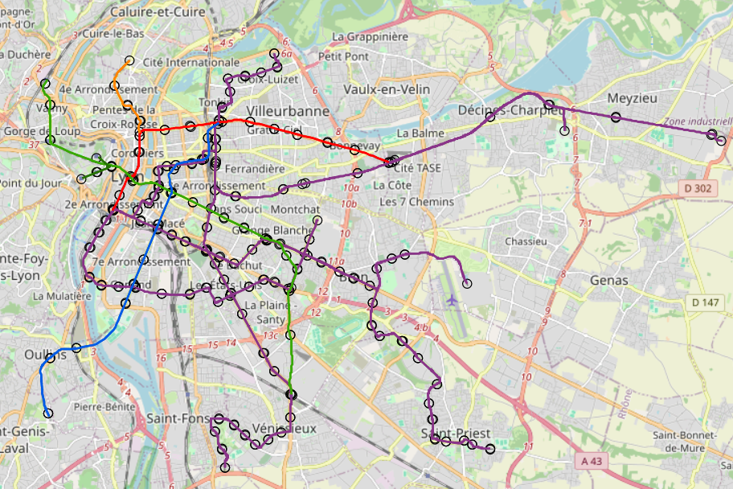
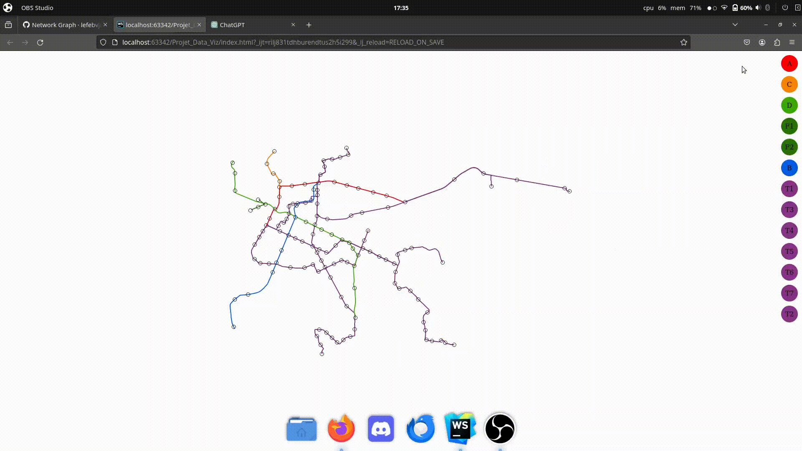
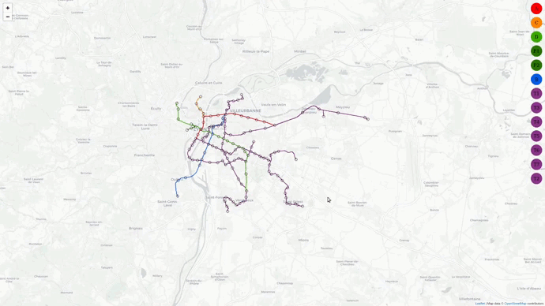
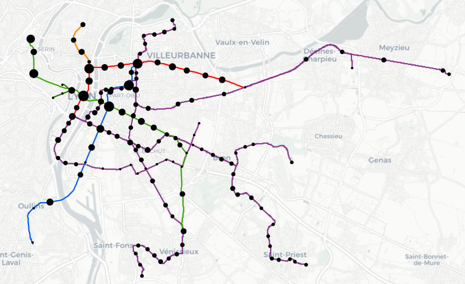
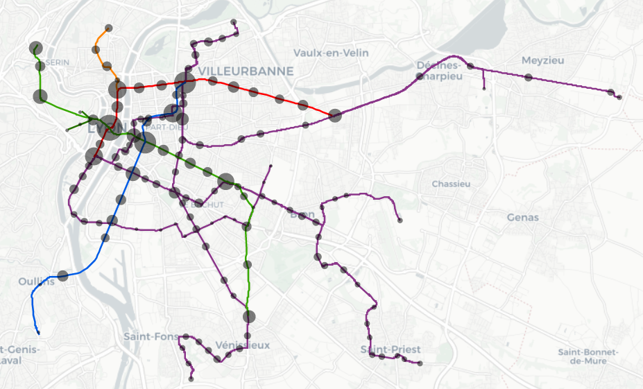
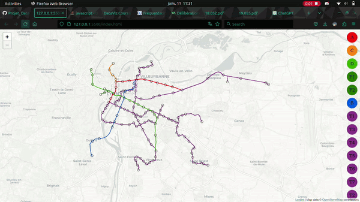
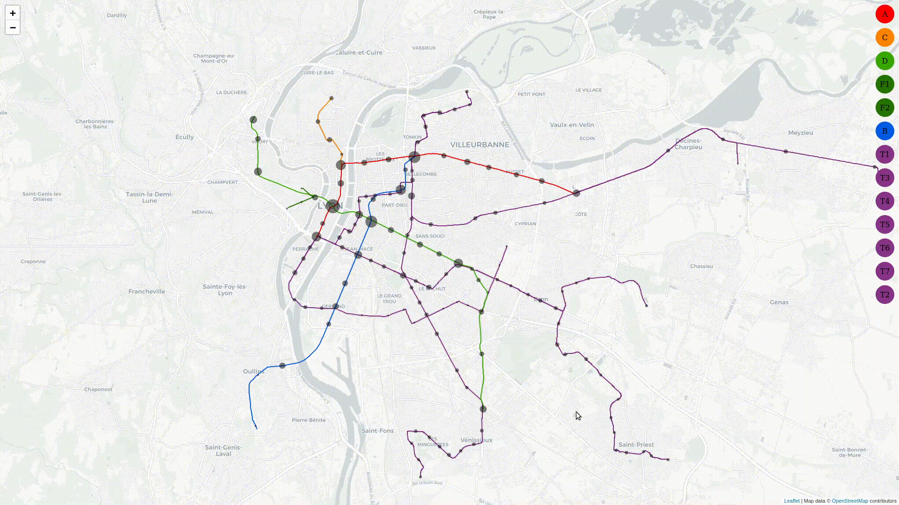
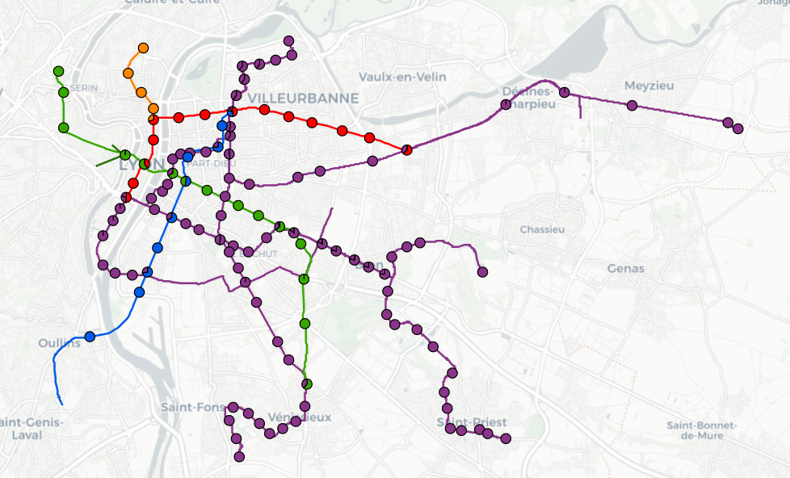

### LEFEBVRE Julien & MERCIER Loris & RAVELLA Nino
# Projet_Data_Viz

## Liens utiles
### Info générales
- [Horaire temps réelle](https://data.grandlyon.com/portail/fr/jeux-de-donnees/prochains-passages-reseau-transports-commun-lyonnais-rhonexpress-disponibilites-temps-reel/info)
- [Horaire temps théoriques](https://data.grandlyon.com/portail/fr/jeux-de-donnees/horaires-theoriques-reseau-transports-commun-lyonnais/telechargements) (*Trop lourd pour github : Choisir codage NEPTUNE lors du téléchargement*)
- [Info traffic temps réelle](https://data.grandlyon.com/portail/fr/jeux-de-donnees/alertes-trafic-reseau-transports-commun-lyonnais-v2/api)
- [Accessibilité](https://data.grandlyon.com/portail/fr/jeux-de-donnees/alerte-accessibilite-reseau-transports-commun-lyonnais/api)

### Info géographiques
- [Ligne Métro/Funi](https://data.grandlyon.com/portail/fr/jeux-de-donnees/lignes-metro-funiculaire-reseau-transports-commun-lyonnais-v2/info) --> (*[voir fichier](./data/sytral_tcl_sytral.tcllignemetrofuni_2_0_0.json)*)
- [Ligne Tram](https://data.grandlyon.com/portail/fr/jeux-de-donnees/lignes-tramway-reseau-transports-commun-lyonnais-v2/info) --> (*[voir fichier](./data/sytral_tcl_sytral.tcllignetram_2_0_0.json)*)
- [Point d'arrêt](https://data.grandlyon.com/portail/fr/jeux-de-donnees/points-arret-reseau-transports-commun-lyonnais/telechargements) --> (*[voir fichier](./data/sytral_tcl_sytral.tclarret.json)*)

## Avancement
### Séance 1 : 13 décembre
**Tous les 3 :** 
- Brainstorming sur les données à utiliser et les visualisations à faire. => *Choix pour une visualisation du réseau TCL avec horaire et affluence.*
- Recherche des données sur le site de la métropole de Lyon. 
- Test des API temps réelles

### Séance 2 : 19 décembre
**Loris & Julien :**
- Débrief et analyse des données trouvées.
- Filtrage des données pour ne garder que les arrêts de métro et tram.
  - Création du fichier [sytral_tcl_sytral.tclarret_sans_bus.json](./data/sytral_tcl_sytral.tclarret_sans_bus.json) qui contient les arrêts de métro, tram et funiculaire.
- Première visualisation brute:
  -  Configuration de la projections
  - Affichage des arrêts de métro, tram et funiculaire
  - Affichage des lignes de métro, tram et funiculaire
  - Mise en dimension
  - Coloration des lignes avec les couleurs **officielles** du réseau TCL
  - 

### Vacances de Noël
**Loris :**
- Ajout d'un fond de carte leaflet
- Mise en relation des coordonnées d3js avec les coordonnées leaflet

**Julien :**
- Ajout de données en info-bulle
- Debug fond de carte leaflet
- Filtrage des données pour ne plus avoir de doublons (plusieurs arrêts avec le même nom et les lignes pour chacun des sens)
- Ajout des boutons pour filtrer les lignes et afficher seulement les souhaitées
  
- Résolution du hover qui ne fonctionnait plus avec le fond de carte et fusion de la branche sans-fond avec le main

### Séance 3 : 9 janvier
**Tous les 3 :**
- Débrief et analyse de notre carte
- Recherche de nouvelles données  
=> *Ajout des données d'affluence par jour et par station*
- Recherche de nouvelles visualisations

### Semaine 9-16 janvier
**Loris :**
- Formatage des données d'affluence
  - Correction des noms d'arrêts
  - Formattage du fichier
  - Conversion en CSV
  - Jointure avec les données d'arrêts dans le JSON
- 1ère version de l'affichage de l'affluence 

- 2ème version avec affluence globale par station + transparence

**Nino :**
- Première version des pies charts pour l'affluence

**Julien :**
- Ajout d'une fenetre avec les informations de l'arrêt
- Ajout d'un pie chart pour l'affluence avec le détail de chaque ligne et le cumul
- Modification de la taille des arrêts quand on supprime des lignes
- Modification du pie chart quand on supprime des lignes

- Ajout de l'affichage de la présence ou non d'ascenseurs et escalators

### Semaine 9-16 janvier
**Julien :**
- Ajout d'un barplot pour afficher les affluences des ligne
- Ajout d'un bouton pour sélectionner et désélectionner toutes les lignes
- Ajout d'un bouton et d'une page pour afficher les crédits
- Ajout d'une visualisation de l'affluence des stations d'une ligne dans la side bar

**Loris :**
- Création de la légende
- Ajustement de la taille des arrêts en fonction du zoom
- Finitions des éléments de notre visualisation
 
**Nino :**
- Finalisation des pies charts

